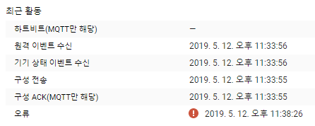

약 1년 전쯤 ESP8266을 이용해 방의 불을 누워서 끄겠다고 알리익스프레스에 모듈 10개를 주문했던 적이 있다.  <!--excerpt-->
그것도 하겠다고 일만 벌려 두고 전기배선같은 일들이 있어서 귀찮아져 버린 바람에 방에 짱박혀 있었는데...  

요즘 사진을 찍으면서 주로 필름 바디를 사용하다 보니, 습기에 대비하기 위해 카메라용 제습함을 싸게싸게 실리카겔과 김치통으로 만들어 두었다.  

그런데 습도계가 집에 없어 얼마나 건조하게 유지되는지 확인할 방법이 없어 이번에 Google Cloud Platform에 익숙해질 겸 ESP8266을 사용해 간단한 온습도계를 만들어 볼까 해서 아래 내용들을 찾아 보았다.

최근에 ESP8266의 Arduino Core 지원이 활발해지면서 Google에서도 자사의 Google IoT Core를 사용할 수 있는 예제 프로젝트를 [GitHub]("https://github.com/GoogleCloudPlatform/google-cloud-iot-arduino")에 올려 두었다.  

AWS 역시 AWS IoT Core 서비스가 있으므로 기존에 AWS를 사용하던 분이라면 한 번 참고해 볼 만한 [예제 프로젝트]("https://github.com/debsahu/ESP-MQTT-AWS-IoT-Core")가 있다.

아무튼, 오늘 이렇게 블로그에 글을 쓰게 된 이유는 굉장히 빡칠만한 일이 있었기 때문인데, ESP8266의 Arduino Core 버전 2.5.0에서는 위의 Google IoT Core Pub/Sub Client 예제가 제대로 작동하지 않는다.

JWT Token도 정상적으로 생성되고, Wi-Fi Station 연결도 문제가 아닌데 대체 뭐가 문제인가 싶었다.  
약 2시간 넘게 Adafruit IO 관련 글에서 해답을 찾을 수 있었는데, 내용은 다음과 같다.  

ESP8266의 Arduino Core v2.5.0을 사용하여 Adafruit IO 예제 중 Publish 예제를 컴파일하면 ArduinoWiFiClient 라이브러리에서 에러가 난다.  
정확한 이유는 모르겠지만 코어 버전이 올라가면서 RTOS SDK 버전도 같이 업데이트 되었는데 이 때문에 문제가 생기는 듯 하다.  

이 때 직감이 왔다.  
아, 설마 Arduino Core 쪽에서 문제가 있나? 싶어서 버전을 v2.4.2로 낮추고 빌드해서 플래싱해 보았더니 짜잔!  

~~개같은~~ 문제가 깔끔히 사라졌다.  

PUBACK/SUBACK도 정상적으로 작동하는 걸 확인할 수 있었다.

이제 I2C 온습도 센서만 기다리면 되는데 아마도 Aliexpress 물건인 만큼 2주 정도는 걸리지 않을까 싶다.
